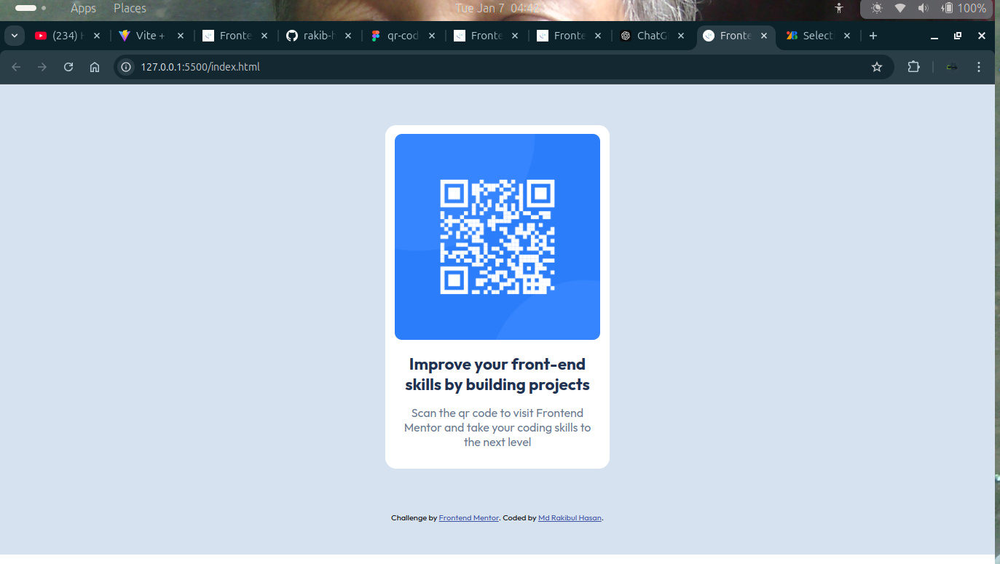

# Frontend Mentor - QR code component solution

This is a solution to the [QR code component challenge on Frontend Mentor](https://www.frontendmentor.io/challenges/qr-code-component-iux_sIO_H). 

## Table of contents

- [Overview](#overview)
  - [Screenshot](#screenshot)
  - [Links](#links)
- [My process](#my-process)
  - [Built with](#built-with)
  - [What I learned](#what-i-learned)
- [Author](#author)
- [Acknowledgments](#acknowledgments)

## Overview

This project is a solution to the QR Code Component challenge from Frontend Mentor. The goal was to build a visually accurate QR code component that is both responsive and follows the design specifications provided. This challenge helped me practice structuring components, working with CSS, and ensuring responsiveness for different screen sizes.

### Screenshot



### Links

- Solution URL: [Git Hub](https://github.com/rakib-hasan-78/qr-code-component-main)
- Live Site URL: [Vercel](https://qr-code-component-main-beige-ten.vercel.app/)

## My process

### Built with

- Semantic HTML5 markup
- Vanilla CSS 
- Flexbox


### What I learned

Through this challenge, I reinforced several key concepts:

 1. Semantic HTML:

  I used semantic elements like <main> and <section> to structure the content, which improves accessibility and clarity.

 2. CSS Flexbox:

  Flexbox was instrumental in aligning and centering the QR code and accompanying text. It simplified creating a responsive layout while keeping the code clean and manageable.

 3. Responsive Design:

  I learned to better use media queries and CSS properties to ensure the component adapts well across various screen sizes.

 4. Typography and Spacing:

  Adjusting font sizes, line heights, and padding to match the design specifications was a valuable exercise in attention to detail.
  This challenge also highlighted the importance of testing designs on multiple devices to ensure consistent user experiences.


```html
<!DOCTYPE html>
<html lang="en">
<head>
  <meta charset="UTF-8">
  <meta name="viewport" content="width=device-width, initial-scale=1.0"> <!-- displays site properly based on user's device -->

  <link rel="icon" type="image/png" sizes="32x32" href="./images/favicon-32x32.png">
  
  <title>Frontend Mentor | QR code component</title>
  <!-- adding custom css -->
  <link rel="stylesheet" href="./style.css">
  <!-- Feel free to remove these styles or customise in your own stylesheet 👍 -->
  <style>

  </style>
</head>
<body>
  <!-- card section -->
  <section id="card">
    <main>
      <div class="card-section">
        <!-- card item -->
        <div class="card-item">
          <!-- card image -->
          <div class="card-image">
            
          </div>
          <!-- card description -->
          <article>
            <h3>Improve your front-end skills by building projects</h3>
            <p>Scan the <span>qr</span> code to visit Frontend Mentor and take your coding skills to the next level</p>
          </article>
        </div>
      </div>
    </main>
  </section>
  <!-- attribution -->
  <div class="attribution">
    Challenge by <a href="https://www.frontendmentor.io?ref=challenge" target="_blank">Frontend Mentor</a>. 
    Coded by <a href="https://github.com/rakib-hasan-78">Md Rakibul Hasan</a>.
  </div>
</body>
</html>
```
```css
@import url('https://fonts.googleapis.com/css2?family=Outfit:wght@100..900&display=swap');
/* basic style */
*{
    margin: 0;
    padding: 0;
    box-sizing: border-box;
}

img{
    width:100%;
    height:100%;
    object-fit:cover;
}
body{
    background-color:hsl(212, 45%, 89%);
    width:100%;
    min-height:100vh;
    display:flex;
    flex-wrap:wrap;
    flex-direction: column;
    align-content: space-around;
    gap:3rem;
    align-items:center;
    justify-content:center; 
    font-family: "Outfit", serif;
}
main{
    width:90%;
    margin: 0 auto;
}
/* card section design */
#card{
    width:100%;
    height:auto;
}
.card-section{
    width: 100%;
    display:flex;
    align-items:center;
    justify-content: center;
    margin-top:1%;
    margin-bottom:1%;
}
/* card item or single card started */
.card-item{
    width:25%;
    padding: 1%;
    background:hsl(0, 0%, 100%);
    border-radius: .9375rem .9375rem .9375rem .9375rem;
    transition: transform 0.3s;
}
.card-item:hover {
    transform: scale(1.05);
}
/* card image  */
.card-image img{
    border-radius: 10px;
}
/* card title  */
article h3{
    color:hsl(218, 44%, 22%);
    text-align:center;
    font-weight:700;
    font-size:1.4rem;
    padding: .9375rem 0 ;
}
/* card paragraph  */
article p{
    text-align:center;
    font-weight:400;
    color:hsl(216, 15%, 48%);
    padding-bottom:.9375rem;
    font-size:1rem;
}
.attribution { 
    font-size: 11px; text-align: center; 
}
.attribution a { 
    color: hsl(228, 45%, 44%); 
}

/* Responsive Design */

/* Mobile (up to 375px) */
@media (max-width: 375px) {
    .card-item {
        width: 85% !important;
        padding:2%;
    }

    article h3 {
        font-size: 1.2rem;
    }

    article p {
        font-size: 0.9rem;
    }
}

/* Tablet (up to 768px) */
@media (max-width: 768px) {
    .card-item {
        width: 45%;
        padding:2%;
    }

    article h3 {
        font-size: 1.3rem;
    }

    article p {
        font-size: 1rem;
    }
}

/* Desktop (1440px and above) */
@media (min-width: 1440px) {
    .card-item {
        width: 25%;
    }

    .card-section {
        gap: 3rem;
    }

    article h3 {
        font-size: 1.6rem;
    }

    article p {
        font-size: 1.1rem;
    }
}
```


## Author

- Git Hub - [Md Rakibul Hasan](https://github.com/rakib-hasan-78)
- Frontend Mentor - [Md Rakibul Hasan](https://www.frontendmentor.io/profile/rakib-hasan-78)


## Acknowledgments

A big thank you to Frontend Mentor for providing this challenge, which allowed me to practice and refine my frontend development skills. I’m grateful for the opportunity to explore the nuances of responsive design and component-based layouts in a practical project.

To anyone reviewing my solution, your feedback is invaluable! 😊
